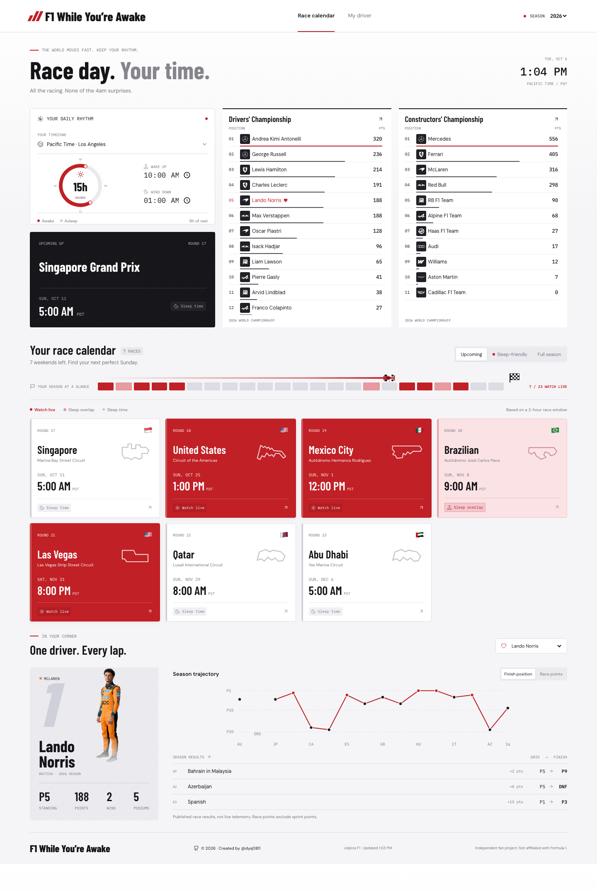

# F1 While You're Awake

By [@dyq0811](https://github.com/dyq0811)

Formula 1, mapped to your day. F1 While You're Awake helps you find races that fit your timezone and sleep schedule, follow your favorite driver, and track both world championships.

Visit **[f1-awake.0811dingy.workers.dev](https://f1-awake.0811dingy.workers.dev)** in your browser.

## Why I built this

F1's timezone switch is handy, but it doesn't know I'm a night owl. I still had to check every race to answer the real question: **will I actually be awake for this?** I'm here for lights out, not a 5am alarm.

I'm also more driver-loyal than team-loyal. My favorites can change garages; I'm still cheering for them. So I built a race calendar around my sleep schedule, with a driver view that follows the person, not the paint job.

## Preview

## Make it yours

1. Choose your timezone. Search by city or timezone name.
2. Set your wake-up time and bedtime.
3. Pick your favorite driver. Search by name or team.
4. Browse the calendar to find races that fit your day. Open a race for the weekend schedule.

Your choices are remembered in the same browser, so you don't need to set them again each visit. No account needed.

## What you can follow

- Race times in your timezone, with daylight-saving changes handled for you.
- Upcoming races, watchable races, or the full season at a glance.
- Practice, qualifying, sprint, and Grand Prix schedules when available.
- Drivers' and Constructors' Championship standings.
- Your favorite driver's points, wins, podiums, and season results.
- Published race results and lap-by-lap positions.
- The 2024, 2025, and 2026 seasons, on desktop or mobile.

### Race colors

| Color | Label | Meaning |
| --- | --- | --- |
| Dark red | Watch live | The entire estimated race window falls within your waking hours. |
| Light red | Sleep overlap | Part of the estimated race window overlaps your sleep. |
| Neutral gray | Sleep time | The estimated race window falls entirely within your sleep. |

Race colors assume a two-hour Grand Prix. Delays or red flags can make a race longer. **Time TBC** means the start time isn't confirmed yet.

## First visit

You'll start with these settings, and can change them anytime:

| Setting | Default |
| --- | --- |
| Timezone | Pacific Time (Los Angeles) |
| Wake up | 8:00 AM |
| Bedtime | 11:30 PM |
| Favorite driver | Driver with the most championship points in the selected season |
| Season | 2026 |

Once you pick a favorite, the app keeps following them even if the championship leader changes. Choose **Follow points leader** to switch back to following whoever leads the standings.

Preferences stay in your browser and aren't uploaded to a user database. Another browser or device will have its own settings.

## About the data

You'll need an internet connection to load schedules, standings, and images.

Results and lap positions are published data, **not live race tracking**. Standings refresh every five minutes while the page is open and visible, but new results only appear once the data provider publishes them.

Championship totals include sprint points. Grand Prix results and the race-points chart count Grand Prix points only.

## Data and credits

- Schedules, standings, results, and lap timings: [Jolpica F1](https://api.jolpi.ca/ergast/f1/).
- Team logos and driver portraits: Formula 1's public media CDN.
- Icons: [Lucide](https://lucide.dev/).
- Fonts: Barlow Condensed, DM Sans, and IBM Plex Mono via [Google Fonts](https://fonts.google.com/).

## Attribution and rights

Copyright (c) 2026.

Independent fan project, not affiliated with or endorsed by Formula 1 or its teams. Third-party data, photography, logos, trademarks, fonts, and libraries remain subject to their respective owners' rights and licenses. Public access to an asset does not automatically grant permission to redistribute it.

This repository does not currently include an open-source license. The author attribution is not a blanket license to reuse the project or its third-party assets.