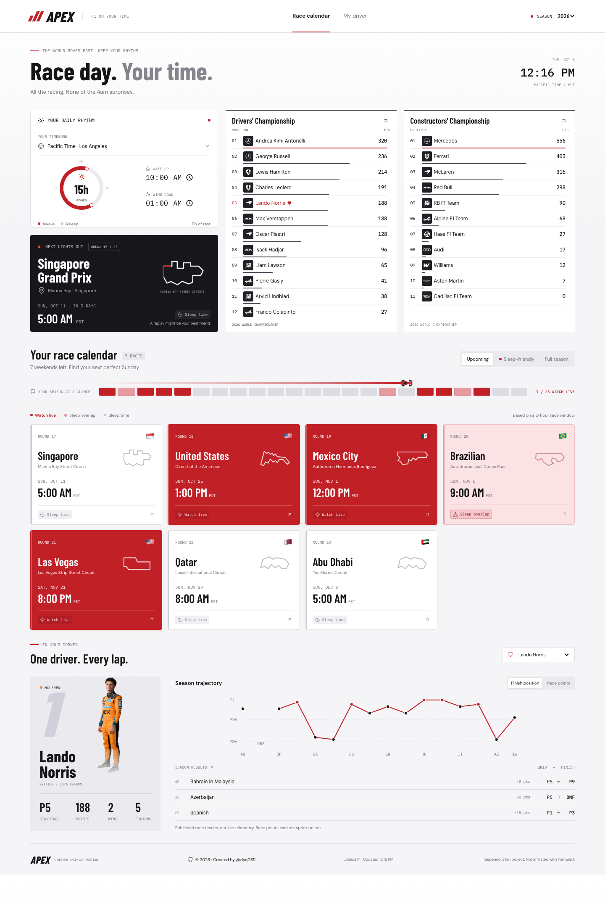

# APEX / F1 on your time

Formula 1, mapped to your day. APEX helps you find races that fit your timezone and sleep schedule, follow your favorite driver, and track both world championships.

Created by [@dyq0811](https://github.com/dyq0811).

## Preview



Preview captured on October 6, 2026. Race schedules and standings change as the season progresses.

## Features

- Searchable timezone picker with eight common suggestions, city/name search, and keyboard navigation.
- Adjustable wake-up and wind-down times, visualized on a 24-hour sleep dial.
- Race times converted to your selected timezone, including daylight-saving changes.
- Upcoming, sleep-friendly, and full-season calendar views.
- Weekend details for practice, qualifying, sprints, and the Grand Prix when published.
- A season overview with a race-car progress marker and fading red trail.
- Scrollable Drivers' and Constructors' Championship standings with team logos and points.
- Favorite-driver selection, championship position, wins, podiums, and season charts.
- Full Grand Prix results and published lap-by-lap position traces.
- Responsive desktop/mobile layout and preferences saved in your browser.
- Season selection for 2024, 2025, and 2026.

### Race colors

| Color | Label | Meaning |
| --- | --- | --- |
| Dark red | Watch live | The entire estimated race window falls within your waking hours. |
| Light red | Sleep overlap | Part of the estimated race window overlaps your sleep. |
| Neutral gray | Sleep time | The estimated race window falls entirely within your sleep. |

Grand Prix estimates use a two-hour window. Actual races can last longer because of delays or red flags. Weekend sessions use their usual scheduled duration. Unconfirmed start times are shown as **Time TBC** rather than being classified as confirmed watchable races.

## Run locally

This is a static HTML, CSS, and JavaScript application. No Node.js, package installation, build command, or API key is required.

From the project folder, with Python 3 installed:

```sh
python3 -m http.server 8001 --bind 127.0.0.1
```

Open **http://127.0.0.1:8001** in a modern browser. Stop the server with **Ctrl+C**. Choose another port if 8001 is already in use.

An internet connection is required for F1 data, team logos, driver portraits, fonts, and icons.

### Default settings

| Setting | Default |
| --- | --- |
| Timezone | Pacific Time / `America/Los_Angeles` |
| Wake up | 10:00 AM |
| Wind down | 1:00 AM |
| Favorite driver | Lando Norris |
| Season | 2026 |

Settings are saved in browser local storage and are specific to each visitor and site origin. They are not uploaded to a user database.

## Deploy

Any static host can serve APEX. For [Cloudflare Pages Direct Upload](https://developers.cloudflare.com/pages/get-started/direct-upload/):

1. Open **Workers & Pages** in your Cloudflare dashboard.
2. Choose **Create application**, then the Pages **Drag and drop your files** option.
3. Name the project and upload this folder, with `index.html` at the upload root.
4. Select **Deploy site** or **Save and Deploy**.
5. Open the assigned `pages.dev` URL and verify that schedules, standings, and images load.

No build step or backend server is needed. Update a Direct Upload site by creating a new deployment with the updated folder. For automatic deployments from a GitHub repository, create a Git-integrated Pages project instead; a Direct Upload project cannot be switched to Git integration later.

## Project files

```text
f1-afterhours/
	index.html      Page structure and author attribution
	app.js          Data fetching, timezone logic, and interactions
	styles.css      Base layout and responsive styles
	modern.css      Current racing-red theme and dashboard layout
	apex-preview.png  README preview image
	README.md       Project documentation
```

## Data and credits

- Schedules, standings, results, and lap timings: [Jolpica F1](https://api.jolpi.ca/ergast/f1/).
- Team logos and driver portraits: Formula 1's public media CDN.
- Icons: [Lucide](https://lucide.dev/).
- Fonts: Barlow Condensed, DM Sans, and IBM Plex Mono via [Google Fonts](https://fonts.google.com/).

Results and lap progress are published historical data, **not live telemetry**. Championship totals include sprint points; the Grand Prix results and race-points chart exclude sprint points. Circuit drawings are stylized illustrations, not precise track maps.

Data is fetched when the page loads or the selected season/driver changes; standings do not automatically refresh in the background. Reload the page to request updated data. External services may impose rate limits or become unavailable; the app displays unavailable-data states rather than fabricating results.

## Attribution and rights

Copyright (c) 2026 [@dyq0811](https://github.com/dyq0811). Created by @dyq0811.

Independent fan project, not affiliated with or endorsed by Formula 1 or its teams. Third-party data, photography, logos, trademarks, fonts, and libraries remain subject to their respective owners' rights and licenses. Public access to an asset does not automatically grant permission to redistribute it.

This repository does not currently include an open-source license. The author attribution is not a blanket license to reuse the project or its third-party assets.